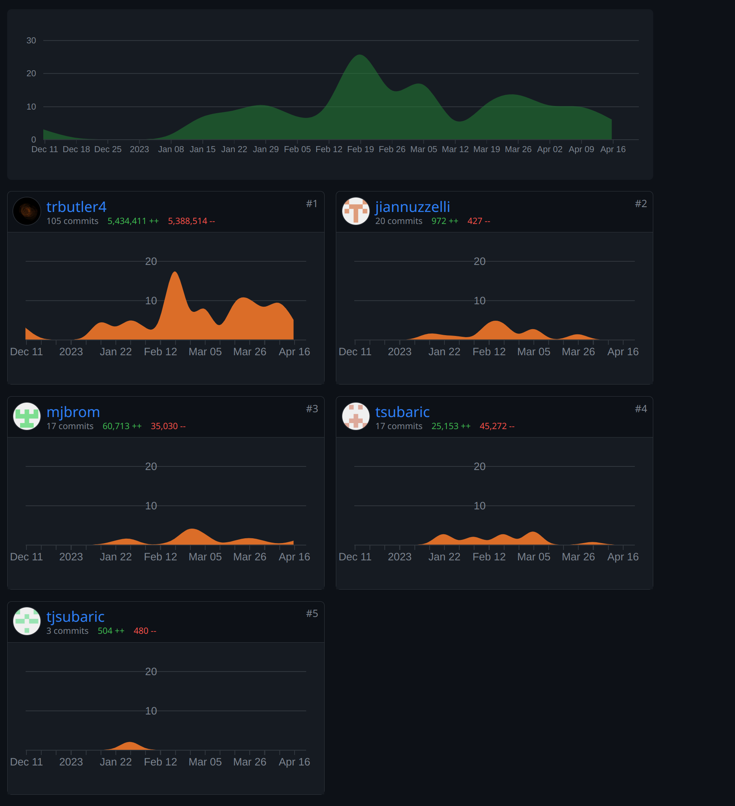
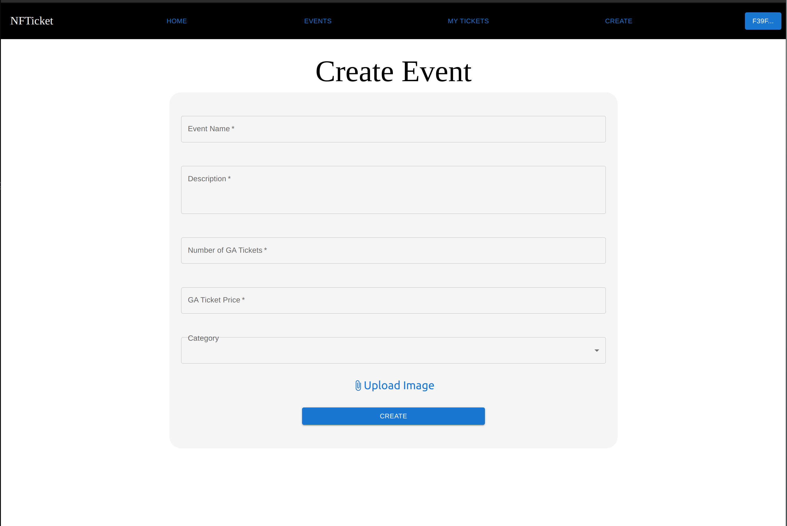
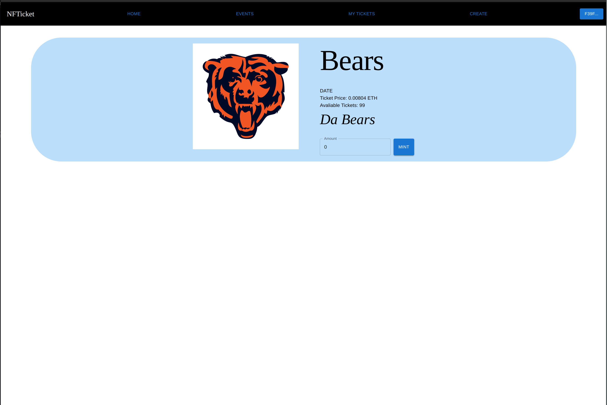
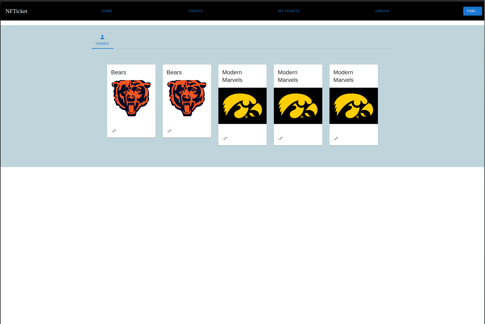
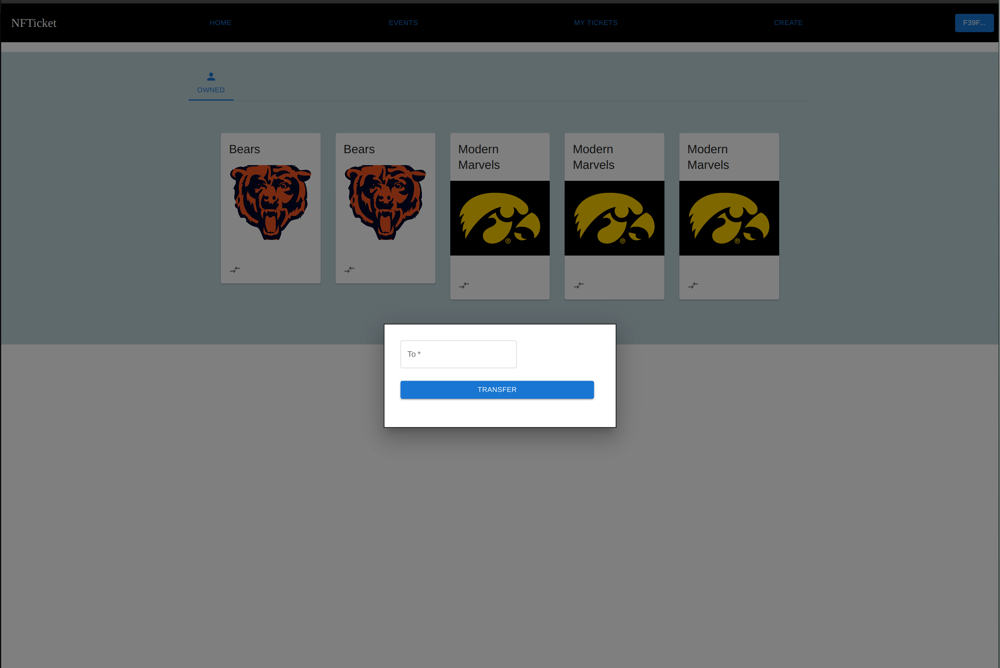

### ECE:4890, ECE Senior Design 

### Final Project Documentation 

#### Team 3: Thomas Butler, Jordyn Iannuzzelli, Tommy Subaric, Mark Brom 

 
 

#### Introduction

Digital Ticketing is an industry that is rife with problems. Scalpers billions from 
event goers, souvenier tickets are gone, and replaced with a email printout with some 
qr code on it. Transferring tickets you bought can be a nightmare, and there is no way 
to prevent scams from taking place when digital tickets are resold. NFTicket looks to solve
these problems by leveraging smart contract on Ethereum, to represent digital tickets as NFTs. 
NFTs, or Non-Fungible Tokens, are unique digital identifiers that are used to certify ownership
and authenticity. By representing digital tickets in this way, NFTickets allows users to very 
easily create ticket-gated events, purchase tickets for those event, and transfer tickets to 
any Ethereum compatible wallet. Furthermore, because of the way NFTs work, mechanisms can be 
put into place to prevent resellers from selling fake or already redeemed tickets, as well 
as pay royalties back to the original creator on each resell. 

#### Project Outcome 

Overall, the outcome of the project was a success. The core design constraints were met, 
users can create events, purchase tickets, redeem tickets, and transfer tickets on our 
website. The event information is stored in a Firebase database, with the smart contract 
acting as the source of truth, storing low level event information, handling ticket ids, mint, 
transfer, and redemption. We did change from ERC-721 to ERC-1155 token standards to allow for 
easier batch transfers of tickets, and we ended up using a NoSQL database instead of an SQL 
database because it made more sense once we started building. Unfortunately, we did fall short 
of our goal to provide a local wallet for the user, instead opting for MetaMask as our 
wallet provider. This means that users will need to have a MetaMask wallet already in order
to interact with our website. It should be noted, however, that the concept of providing 
wallets for users with something as simple as a username and password is a new concept 
in Ethereum, and not very many solutions yet exist for it. Even as we were working on this 
project, Ethereum ERC-4337 was introduced, providing account abstraction, 
which aims to solve the same problem that we were trying to solve. 

Because of the lack of Ethereum development experience across the team, Thomas worked on the smart 
contract and overall design of the project, incduing backend hosting and database, as well as front 
end components. Mark, Tommy, and Jordyn contributed to building the front-end, as well as writing 
documentation and reports. 

Throughout this process, the team utilized various project management skills and process to 
ensure the completion of the project. 
1. Planning: we created a detailed project plan, and tracked progress and tasks using Jira. This 
helped us learn how to manage multiple different tasks, and deadlines in a team environment. 
2. Communication: we communicated regularly, and made sure to help each other out. There was a 
a learning curve for everyone, so working together was important to make sure everyone stayed 
on the same page. 
3. Risk Management: the team identified potential risks and roadblocks that could affect 
the projcts success, and took decisive actions to mitigate those risks and keep the project on track. 
4. Time Management: the team learned how to schedule and proritize tasks, it was important 
to prioritize tasks so that nobody was holding anyone else back. If a task needed to be completed
before another task could be worked on, we made sure that it was done first. 

Overall, the project management skills and process that we developed were extremely helpful in 
ensuring the success of the project. These skills helps use to stay organized, focused, and on 
track throughout the project, and I think will be invaluable going forward in our careers as 
engineers. 

The github contribution history can be seen below. It should be noted that not everyone 
was initially able to contribute as much do to different levels of experience with the technologies
used.
 - trbutler4: Thomas Butler 
 - jiannuzzelli: Jordyn Iannuzzelli 
 - mjbrom: Mark Brom 
 - tsubaric, tjsubaric: Tommy Subaric 

#### Design Documentation 

**Design Concept**

The initial design concept was actually much more complex than what we ended up doing. At first, 
it was expected that we would have an overarching embedded user wallet. This was eventually 
axed in favor of users using a MetaMask wallet, as user owned wallets are the current standard 
for Ethereum applications, and MetaMask is the most common one. This allowed for a much simpler
user interface, and gave us more time to focus on more essential features. Our final design came 
about through trial and error, as we learned more and built more, we had to be decisive about was 
was working and what was not. Through this decisiveness we were able to focus on the essential aspects
and deliver a simpler, more user friendly design. While it does not have all of the features 
initially planned, and does solve the problem and meets the specification.

**Analysis of Possible Solutions and Tradeoffs**

Initally, we had planned to represent tickets using the ERC-721 standard. After further 
review, we decided to switch to the ERC-1155 token standard. This is a relatively small change, 
but it allowed us to mint and transfer multiple tickets at a time, and also allows for more 
flexibility in the ticket design going forward. This is because ERC-1155 tokens can be either 
fungible, or non-fungible, while ERC-721 tokens are strictly non-fungible. Also, the question of 
how to store event information was not so simple. In smart contracts, there is a tradeoff between 
how much data your contract uses, and how much that contract actaully costs to deploy. The same 
thing goes with transactions. The more data and logic that a smart contract method must process, 
the more expensive that transaction becomes. However, if no data is stored in the contract, 
than some of the benefits of its immutability are lost. The tradeoff we landed on was to store 
essential information in the smart contract, such as event and ticket ids, as well as ticket and 
event owners and ticket redemption status in the contract. The rest of the data, such as the event 
data, name, description, and other information can be stored in the database. This way, event 
creators can easilty update this information at no cost, while the core event funtionality is 
kept decentralized and immutable with the smart contract. 

**Constraints**

The constraints we set out to satisfy in our project proposal were as follows:

1. The system shall be easily used on any web browser.
2. The system shall ensure that transactions complete in under 1 minute, at little  
or no cost to the user. 
3. The system shall be compatible with any EVM compatible network. 

In order to accomplish the first constraint, we created a React app using Material UI, with 
Firebase hosting and database. These tools are considered to be some of the best, and 
easily work on any browser. Constraints 2 and 3 were met by writing our smart contract in 
Solidity, and deploying to Polygon. This ensures that transactions are quick and cheap. Also, we 
followed ERC standards for tokens, which ensures EVM compatiblity. 

**Standards** 

We followed ERC-1155 token standard for our digital tickets. This is different than our original 
plan to use ERC-721 token standard, and the reason for switching is discussed above. QR code for 
redemption is ISO 27001 compliant. User wallets are Ethereum accounts, and a user can import any 
wallet into MetaMask to use with our site.

**Architecture** 

**UI/UX**

Home Page 

Creating an Event 

Events Page 

Event Page 

My Tickets Page 

Transferring Ticket Dialogue 

**Maintainance** 

Currently, the smart contract supports up to 999 events, and each event can have up to 99999999 tickets. 
In order to increase this number, the contract will need to be modified, but this should be enough for 
now. The contract can be redeployed if need be to reset the events and tickets, and the previous
will still exist, however the database will overwrite old event information. The site needs to be hosted,
and there is a data limit with firebase. Other than that, there is no maintainence needed once the 
contract is deployed on chain.

#### Test Report 

For testing, we employed two different tools. For testing our smart contract, we used Hardhat, which is 
an Ethereum development environment which includes a locally hosted node. Hardhat lets use write tests 
in JavaScript, and test on the local Ethereum network. For testing our front end, we used Cypress. 

| Requirement                                   | Test Type | Test Result |
| ------------                                  |---------- | ----------- |
| Users can create events                       | Hardhat   | Pass        |
| Users can mint tickets                        | Hardhat   | Pass        |
| Users can redeem tickets                      | Hardhat   | Pass        |
| Contract returns tickets owned by user        | Hardhat   | Pass        | 
| Contract can transfer tickets                 | Hardhat   | Pass        | 
| Home page displays all relevant information   | Cypress   | Pass        | 
| Event page displays relevant information      | Cypress   | Pass        |
| Create event page has all needed forms        | Cypress   | Pass        |
| My Tickets page displays owned tickets        | Cypress   | Pass        | 

#### Appendices 

[Source Code](https://github.com/trbutler4/NFTicket)

